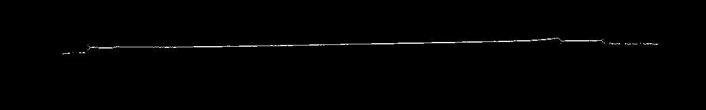

# Generación de una Nube de puntos a partir de Imágenes de perfilación láser

Se desea realizar la reconstrucción 3D a partir de un conjunto de imágenes de perfilación láser, las imágenes son como muestra la figura de abajo y se encuentran en el directorio llamado: imagesReconstruccion. Hay un total de 59 imágenes.

<div style="text-align:center">  </img></div>

Para este caso no se conocen los parámetros intrínsecos de la cámara ni el arreglo de la cámara con el láser. Por esto razón la representación 3D del objeto no corresponderá a las dimenciones del mundo real.

En este archivo solamente se muestra el procedimiento que se realizó para la obtención de la nube de puntos. Para ver el resultado se debe ejecutar el archivo llamado: reconstruction.py

## Dependencias
Las principales librerías a emplear son numpy (para las transformaciones de la imagen), openCV (para el preprocesamiento) y Vedo (para la visualización de la nube de puntos )

* numpy==1.16.4
* opencv-python==4.1.2.30
* vedo==2020.4.0

## Instalar dependecias
```
pip3 install -r requirements.txt
```

## Preprocesamiento de las imágenes

Las imágenes aquí dadas ya se encuentran segmentadas. Adicional a esto es necesario realizar un preprocesamiento debido a que las imágenes presentan las líneas del láser demasiado gruesas, para ello se procede a realizar una 'esqueletización' de las imágenes:

## Imágen original:
<div style="text-align:center">  </img></div>

## Imágen esqueletizada:
<div style="text-align:center">  </img></div>

## Transformación a nube de puntos 

Para la transformación primero se encuentran las coordenadas (u,v) que correspondan a la linea marcada por el láser, seguido a esto se crea una tercer coordenada que será el desplazamiento del objeto (profundidad). De aquí se obtienen las coordenadas (x, y, z) de la nube de puntos. Adicional a esto es necesario recortar la nube de puntos resultante ya que contiene información no necesaria. Por último visualizamos la nube de puntos con la librería vedo. 

### Nube de puntos resultante
<div style="text-align:center">  </img></div>

### Nube de puntos recortada
<div style="text-align:center">  </img></div>

Si deseamos podemos aplicar un filtro a la nube de puntos para disminuir ruido y agrupar los puntos con sus vecinos más cercanos

### Nube de puntos con filtro
<div style="text-align:center">  </img></div>


